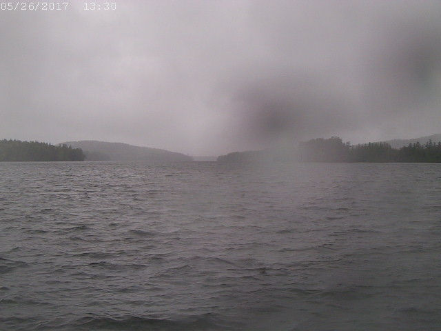

<html>  </html>

Paul Smith's College and the Saranac lake Foundation maintains an environmental monitoring platform on the lower basin of Upper Saranac Lake, NY. The platform collects surface weather data and limnological data from the surface to 27m. Data is freely accesible, but attribution to Paul Smith's College Adirondack Watershed Institute and our funding sources is requested. Support for the environmental monitoring platform comes from the National Fish and Wildlife Foundation and the Saranac Lake Foundation.

A technical report on the water chemistries of Upper Saranac Lake and its tributaries is available <html> <a href="http://www.adkwatershed.org/sites/default/files/usl2016report.pdf" >HERE.</a> </html>

For More Information, contact Sean Regalado: sregalado[at]s.paulsmiths.edu

<html> <b>Current photo from the platform</b></html>

<html>  </html>